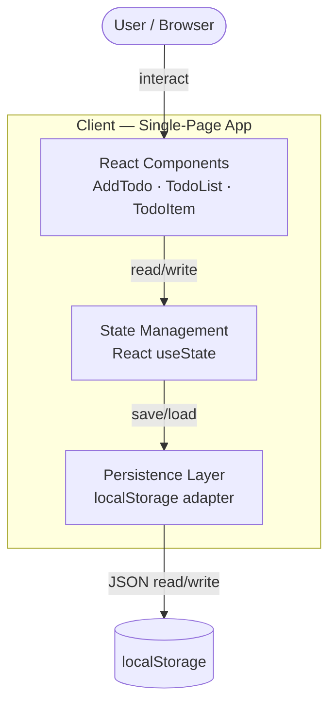

# System Overview — Simple Todo App

## Architecture Diagram



## Tech Stack

| Layer | Choice | Rationale |
|---|---|---|
| Language | TypeScript 5 | Type safety; catches bugs at compile time |
| UI Framework | React 18 | Component model fits the small widget-style app; large ecosystem |
| Build Tool | Vite | Fast dev server, zero-config for React + TS |
| Styling | CSS Modules | Scoped styles, no runtime cost, no extra dependency |
| Persistence | `localStorage` | Meets MUST 5 (survive refresh) with zero backend |
| Testing | Vitest + React Testing Library | Vitest pairs natively with Vite; RTL for DOM assertions |
| Linting | ESLint + Prettier | Consistent code style |

## Key Decisions

1. **No backend / no database.** Requirements specify local persistence only; `localStorage` fulfills this with the least complexity.
2. **Plain `useState` over external state libraries.** The data model is a single flat list of todos — no need for Redux, Zustand, or Context.
3. **Persistence adapter pattern.** A thin `storage.ts` module wraps `localStorage` so the rest of the app never calls `localStorage` directly. This keeps the door open for swapping to an API later without touching components.
4. **Single-page, single-route.** No router needed — the app is one screen.

## Data Model

```typescript
interface Todo {
  id: string;       // crypto.randomUUID()
  text: string;
  completed: boolean;
}
```

Stored in `localStorage` under key `"todos"` as `JSON.stringify(Todo[])`.

## Handoff

- **Artifacts produced:** `docs/architecture/00-system-overview.md`
- **Env vars needed:** None — the app is entirely client-side with no external services.
- **API keys needed:** None.
- **BLOCKER:** None.
